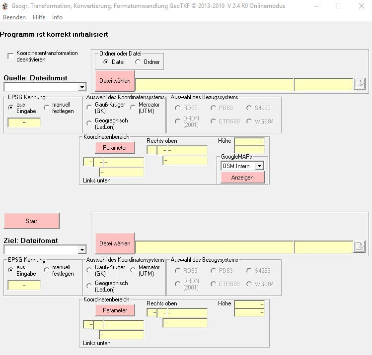
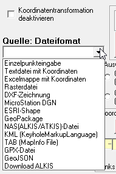

Oft steht man vor der Aufgabe [Geodaten](/gis/was-sind-geodaten "Was sind Geodaten?") zu [transformieren](/gis/utm-transformationstool/ "UTM Koordinaten transformieren"), konvertieren oder in ein anderes Format umzuwandeln. Hierzu gibt es im Internet zahlreiche [Anwendungen](/gis/welche-gis-anwendungen-gibt-es/ "GIS Anwendungen"), mit denen man das erledigen kann.

## Koordinatentransformation und Formatumwandlungen (Konverter)

Auf der Seite [gis.makobo.de](http://gis.makobo.de/) werden Tools dafür angeboten, die man herunterladen und auf seinem Rechner lokal installieren kann.

Im Grunde gibt es 5 Konverter von gis.makobo.de um [GIS](/gis/was-ist-gis "Was ist GIS?") bzw. Geodaten umzuwandeln. Diese unterscheiden sich für den Anwendungesbereich bzw. die Region in welchen die Daten vorliegen und transformiert werden sollen.

1.  [GeoTKF](http://gis.makobo.de/geotkf/) - Deutschland
2.  [KooTransSN](http://gis.makobo.de/kootranssn/) - Sachsen
3.  [KooTransBW](http://gis.makobo.de/kootransbw/) - Baden-Württemberg
4.  [KooTransBY](/geodaten-transformation-konvertierung-und-formatumwandlung) - Bayern
5.  [FreeGPSKonv](http://gis.makobo.de/freegpskonv/) - Weltweit

##GeoTKF

In diesem Beitrag werde ich auf [GeoTKF](http://gis.makobo.de/geotkf/) für [Deutschland](/gis/geodaten-deutschland-download/ "Geodaten Deutschland") eingehen. Dieses Transformationstool kann man als ZIP-Datei herunterladen, welche dann nur entpackt werden muss.

Mit der entpackten Datei "GeoTKFV2_4R0.exe" wird das [Programm](/gis/gis-software-optionen/ "GIS-Programme") gestartet. Und man sieht folgende Oberfläche:

Um Dateien korrekt transformieren zu können muss zuerst die passende Gitterdatei eingebunden werden. Diese findet man zum Beispiel auf der Webseite der [Bayrischen Vermessungsverwaltung](https://www.ldbv.bayern.de/vermessung/utm_umstellung/trans_geofach.html) unter "Geofachdaten mit Bezug zum Liegenschaftskataster". Diese sollte man sich vorab schon einmal herunterladen, da das je nach Internetverbindung ein paar Minuten in Anspruch nehmen kann.

Mit diesem Tool kann man nun Geodaten in unterschiedliche Koordinatensysteme transformieren bzw. konvertieren oder einfach nur Formate umwandeln.

## Unterstützte Dateiformate

Mit GeoTKF können

*   Einzelpunkte
*   Textdateien mit Koordinaten
*   Excelmappen mit Koordinaten
*   Rasterdateien
*   DXF-Zeichnungen
*   MicroStation DGN
*   ESRI-Shapefiles
*   Geopackages
*   NAS (ALKIS/ATKIS)-Dateien
*   KML-Dateien
*   TAB (MapInfo Dateien)
*   GeoJSON und
*   ALKIS-Daten per Download (Sachsen und Thüringen)

konvertiert und transformiert werden. Also praktisch alle Geodaten mit denen man in Berührung kommt.

Das passende Dateiformat kann man über ein Dropdown Menü bei "Quelle: Dateiformat" auswählen.

## Auswahl der EPSG Kennung und des Koordinaten- bzw. Bezugssystems

Anschließend kann ein eine einzelne Datei oder ein ganzer Ordner selektiert werden, in dem alle passenden Dateiformate dann transformiert bzw. konvertiert werden.

Falls man Ordner wählt, wird zur Überprüfung auch noch einmal die Dateianzahl angezeigt.

Sofern eine EPSG-Kennung in den Metadaten der Dateien angegeben ist wird diese automatisch erkannt. Anderfalls kann man diese auch manuell festlegen.

Nun bestimmt man das Koordinatensystem der Quelldatei also

*   [Gauß-Krüger](https://de.wikipedia.org/wiki/Gau%C3%9F-Kr%C3%BCger-Koordinatensystem) (GK)
*   [Mercator](https://de.wikipedia.org/wiki/UTM-Koordinatensystem) (UTM) oder
*   [Geographisch](https://de.wikipedia.org/wiki/Geographische_Koordinaten) (LatLon)

und den dazugehörigen Gauß-Krüger-Streifen oder die UTM-Zone.

Man hat nun die Möglichkeit sich diese Koordinaten über [OpenStreetMap](/gis/openstreetmap-daten-downloaden) oder Google Maps anzeigen zu lassen und kann diese so ggfs. überprüfen.

Das gleiche muss man nun auch für die Zieldatei/en machen. Also Bestimmung der EPSG-Kennung, Auswahl eines Koordinaten- und Bezugsystems.

Falls man nur das Dateiformat konvertieren möchte, hat man auch die Möglichkeit über ein Häckchen in "Koordinatentransformation deaktivieren" die Transformation zu deaktivieren, sodass die Datei nur vom Quellformat in das Zielvormat konvertiert wird.

Mit einem Klick auf "Start" wird das Tool gestartet und die Geodaten transformiert und/oder konvertiert.

Falls etwas ungewöhnlicherweise nicht funktionieren sollte gibt es auf der selben Webseite auch ein Forum, in dem man Fragen über die [GIS-Anwendungen](/gis/open-source-gis-anwendungen/ "Open-Source GIS-Anwendungen") stellen kann.

[http://forum.makobo.de/index.php](http://forum.makobo.de/index.php)