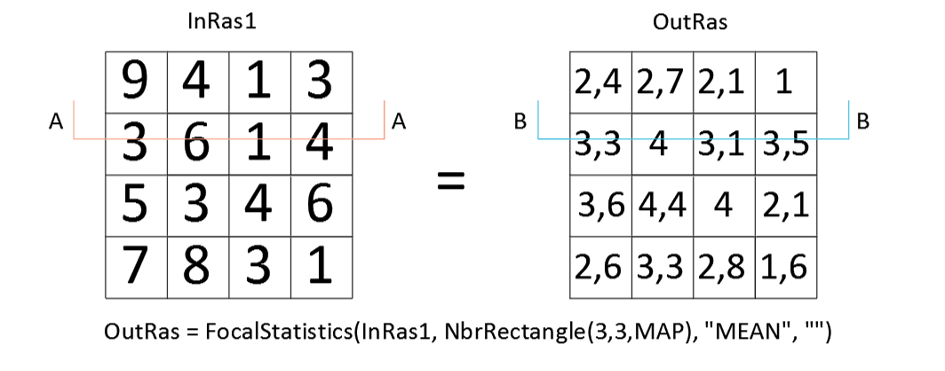

Aus einem [Raster](/gis/was-sind-geodaten)-[DGM](https://de.wikipedia.org/wiki/Digitales_H%C3%B6henmodell) können Hohl- und Vollformen also Mulden und Senken sowie Rücken und Gipfel extrahiert werden.

Im Prinzip wendet man dafür eine fokale Mittelwertsbildung am Ausgangsgeländemodell an und subtrahiert dieses Ergebnis vom Ursprungsmodell. _Als Einstieg lohnt es sich den Artikel [Erstellen und Analysieren von Oberfläche](https://desktop.arcgis.com/de/arcmap/10.3/analyze/commonly-used-tools/surface-creation-and-analysis.htm "Erstellen und Analysieren von Oberfläche") von Esri durchzulesen._

Anwendungsbereiche dafür können Abschätzungen von Bodenfeuchte, Windexponiertheit, Schneedeckendauer und noch viel mehr sein. 

## Fokale Mittelwertbildung

Als erstes wendet man dafür wie bereits erwähnt eine fokale Mittelwertbildung am Ursprungs-Raster-DGM an. Dies kann man zum Beispiel mit einer 3x3 Pixel Nachbarschaft machen. In Arc[GIS](/gis/was-ist-gis "Was ist GIS?") Pro bietet sich hier das Tool "[Statistics](https://pro.arcgis.com/de/pro-app/help/data/imagery/statistics-function.htm)" aus den Raster-Funktionen an.

Die folgende Grafik visualisiert, was dabei genau geschieht. 

Für jedes Pixel werden die umliegenden Pixel in dem zuvor definierten Nachbarschaftsbereich ermittelt und mit den Werten dieser Pixel wird ein fokaler Mittelwert berechnet.

## Differenzraster

Aufgrund der Mittelwertbildung haben Pixel, die zuvor einen hohen Wert hatten nun geringere Werte, da diese an die noch niedrigeren „angeglichen“ wurden. Pixel mit zuvor niedrigeren Werten haben nun einen höheren Wert. Übertragen auf Hohl- und Vollformen bzw. Täler und Gipfel würde das bedeuten, dass die Gipfel nun niedriger und Täler nun höher liegen.

Mithilfe dieser Differenz von der „neuen zur alten Höhe“ können nun die Hohl- und Vollformen aus dem Ausgangsgeländemodell extrahiert werden, welche die folgende Abbildung mit den zwei Querschnitten „A“ und „B“ durch das Rastermodell visualisiert.

Der schraffierte Bereich stellt hier die Differenz dar. In ArcGIS Pro kann man diese Differenz zum Beispiel mit der Raster Funktion "[Minus](https://pro.arcgis.com/de/pro-app/help/data/imagery/minus.htm)" durchführen.

Nachdem man das Raster mit den Mittelwerten von dem Ausgangsgeländemodell subtrahiert hat erhält man die Hohl- und Vollformen in einem neuen Raster und kann diese nun für den jeweiligen Anwendungszweck weiter analysieren.