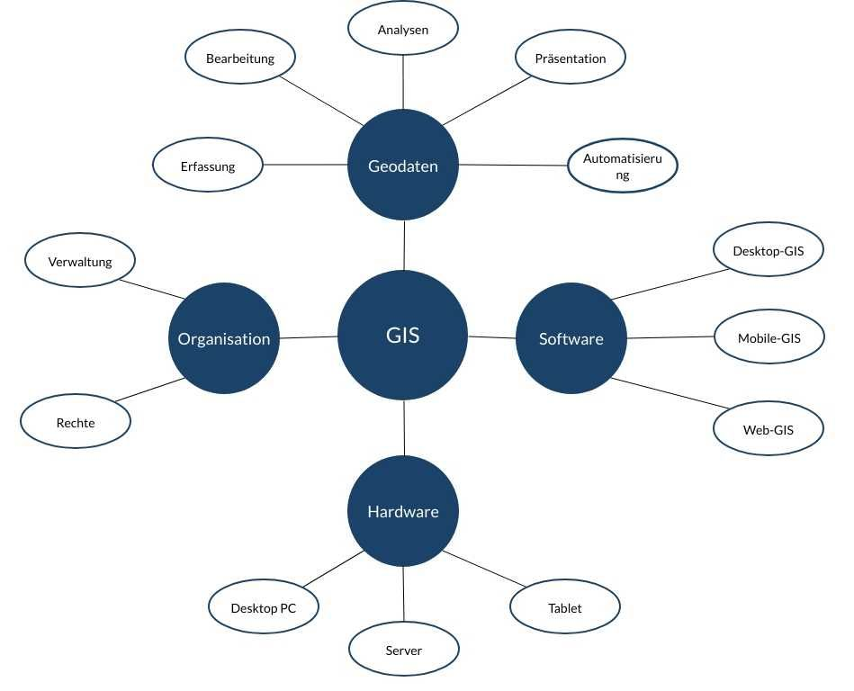
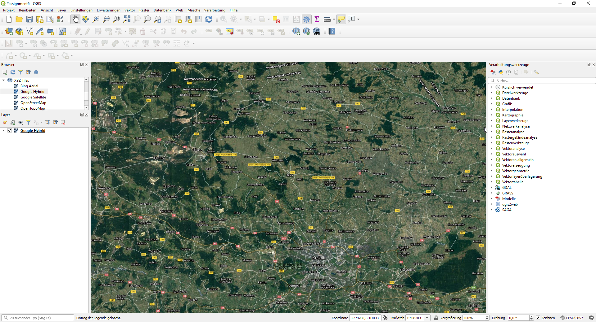

Die Abkürzung GIS steht für **G**eoinformat**I**ons**S**ystem.

Ein Geoinformationssystem bzw. **GIS** bezeichnet ein System zur Darstellung und Bearbeitung von Geodaten, also digitale Daten, denen eine räumliche Lage zugewiesen wurde.

Mit einem Geoinformationssystem kann man komplexe Sachverhalte strukturiert darstellen, präsentieren und analysieren.

Mitte der 80ger Jahre etablierte sich ein GIS Markt. Vor allem Behörden und Universitäten erkannten zuerst den großen Nutzen, den der Einsatz von GIS mit sich bringt. Durch den rasanten technischen Fortschritt der Computer konnten die ersten GIS-Arbeitsplätze geschaffen werden.

Rein Graphisch besteht ein GIS aus einer Karte auf der Daten bzw. [Geodaten](/gis/was-sind-geodaten "Was sind Geodaten") visualisiert werden können. Als Definition von GIS könnte man auch (so wie Arni) Google Maps mit Straßen, Orten usw. nennen, da man mit Google Maps Geodaten analysieren und visualisieren kann (Wie komme ich am schnellsten von Punkt "A" nach Punkt "B"?).

Google Maps hilft dabei den schnellsten Weg zwischen zwei Punkten oder Orten unter Berücksichtigung verschiedener Verkehrsmittel zu finden und ist eine interaktive Karte ([Web-GIS](/gis/web-gis "Web-GIS")).

> Eine kostenlose Alternative zu Google Maps ist übrigens [OpenStreetMap](https://www.openstreetmap.de/ "OpenStreetMap"). OpenStreetMap, auch OSM, ist ein Projekt, das sich damit beschäftigt eine freie Weltkarte für alle zu erschaffen. Diese wird unter der Lizenz "[Open Database Licence (ODbL) 1.0](http://opendatacommons.org/licenses/odbl/ "Open Database Licence (ODbL) 1.0")" und kann somit unter anderem auch gewerblich kostenlos genutzt werden.

Bei einem GIS hat man die Möglichkeit, die verschiedensten Geodaten zusammenzuwürfeln, um so neue Muster aus diesen Daten erkennen zu können. Es können zum Beispiel Orthophotos, topografische Karten, statistische Daten und sogar technische Pläne mit eingebunden werden.

Diese werden auf unterschiedlichen **Ebenen** bzw. Layer dargestellt, die man je nach Bedarf ein-oder ausblenden kann. Somit bietet ein Geoinformationsystem mit den entsprechenden Daten die Antworten auf viele Fragestellungen.

* _Wo befinden sich die meisten potentiellen Käufer für ein Produkt?_
* _Wo verlaufen Ver- und Entsorgungsleitungen?_
* _Wo verlaufen Einzugsgebiete von Schulen und inwiefern wirkt sich das auf den öffentlichen Nahverkehr aus?_
* _Wo befinden sich "Corona-Hotspots"?_

Der Fokus liegt hier immer, wie die Fragestellungen bereits vermuten lassen, bei der Räumlichen Komponente. (Wo passiert/befindet sich etwas und was kann ich mit dieser Information anfangen?)

Grundsätzlich besteht ein Geoinformationssystem aus:

*   _[Software](/gis/gis-software-optionen "GIS-Software Optionen") bzw. [Anwendungen](/gis/welche-gis-anwendungen-gibt-es "GIS Anwendungen")_
*   _Hardware_
*   [_Daten_](/gis/was-sind-geodaten "Was sind Geodaten")
*   Management / Organisation

## Welche GIS Software gibt es?

Mittlerweile gibt es eine große Auswahl an [GIS-Software](/gis/gis-software-optionen "GIS-Software Optionen"). Diese gibt es als Open Source Projekte, welche kostenlos zur Verfügung gestellt werden, sowie als kostenpflichtige Versionen, die bis zu mehreren tausend Euro für eine vollausgestattete Version kosten können.

Eine sehr bekanntes **Open Source GIS** ist [QGIS](https://www.qgis.org/de/site/ "QGIS"), welches eine umfangreiche Anzahl an Plugins bietet und wohinter eine sehr große Community steckt, die dieses Projekt vorantreibt. QGIS ist vor allem für Anfänger zu empfehlen, da es viele Dokumentationen gibt und man QGIS natürlich überall frei benutzen kann.

*Screenshot QGIS Benutzeroberfläche*

Zwei der bekanntesten kostenpflichtigen GIS Software Programme sind Esri ArcGIS Pro und AutoCAD Map3D von Autodesk.

Welche Software nun die bessere ist lässt sich pauschal so nicht sagen. Dies hängt von mehreren Faktoren ab, wie zum Beispiel dem Einsatzzweck und dem verfügbarem Budget.

Neben diesen normalen Desktop Geoinformationssystem gibt es auch noch andere [Arten von GIS Software](/gis/gis-software-kategorien "Arten von GIS Software"),wie Web GIS, mit dem sich Karten in Websiten einbauen lassen und andere branchenspezifische Software, die zum Beispielt hilft ein Leitungskataster zu erstellen, welches dann in ein Geoinformationssystem importiert wird.

## Hardware

Zuerst einmal wird selbstverständlich ein leistungsfähiger Rechner benötigt, auf dem die Software reibungslos funktioniert. Die Anforderung der GIS Programme ähnelt den von PC-Spielen, weshalb ein Mittelklasse "Gaming PC" einen guten GIS Arbeitsplatz bietet.

Immer mehr Anwender benutzen nun auch mobile Geräte, zum Beispiel handelsübliche Tablets. Diese lassen sich mit GNSS Empfänger verbinden und man ist in der Lage sehr genaue Geodaten zu erfassen, zu bearbeiten und direkt in ein Geoinformationssystem zu übertragen.

Somit wird viel Zeit und Arbeit gespart, da auf klassische Weise erst Objekte draußen vermessen werden und diese Daten anschließend im Büro eingearbeitet werden, was hier wegfallen würde.

## Daten - Geodaten

[Geodaten sind Informationen](/gis/was-sind-geodaten "Was sind Geodaten"), die einen räumlichen Bezug haben. Alles passiert irgendwo. Wenn man das "was" und "wo" festhält hat man Geodaten.

Es gibt verschiedene Möglichkeiten Geodaten zu speichern und diese in ein Geoinformationssystem einzubinden. Die gängigsten Optionen, wie Geodaten abgespeichert werden sind:

*   in [Datenbanken](/gis/geo-datenbank-optionen "GIS-Datenbanken") (z.B. [PostgreSQL](/gis/postgis-qgis "PostgreSQL"), MariaDB, MySQL usw.)
*   als [Shapefile](/gis/was-ist-ein-shapefile-shp-dbf-shx "Was ist ein Shapefile") (von ESRI entwickeltes Format für Geodaten)
*   als GeoJSON
*   als XML oder KML
*   in [CAD](/gis/unterschied-cad-gis "Unterschied GIS-CAD") Formaten wie DXF/DWG
*   und noch viel mehr (siehe [GIS-Datenformat](https://de.wikipedia.org/wiki/GIS-Datenformat "GIS-Datenformate"))

Diese Daten können lokal oder über das Internet in das Geoinformationssystem eingebunden werden.

(Sehr nützlich ist auch ein sogenannter [Web Map Service](/gis/wms-wmts "Web Map Service") (WMS), mit dem Karte oder Daten im Internet veröffentlicht und somit Anderen zur Verfügung gestellt werden können.)

## Anwendungsbereiche von GIS

Einsatz finden Geoinformationssysteme vor allem in:

*   _Kommunen, Städten, Landkreise, Landesämter (Kommunal GIS)_
*   _Vermessungs- und Katasterwesen_
*   _Energieversorgung (Wasser, Abwasser, Strom, Gas, usw.)_
*   _Immobilienverwaltung_
*   _Ingenieurbüros (Stadt- und Verkehrsplanung)_

[Mehr Beispiele und Anwendungen](/gis/welche-gis-anwendungen-gibt-es "GIS-Anwendungen")

## Fazit

Ein Geoinformationssystem ist in vielen privaten und öffentlichen Bereichen unabdingbar geworden. In einem GIS können Liegenschaftskataster, Versorgungsnetze und noch viel mehr Geodaten sehr einfach eingebunden werden. In dem Geoinformationssyste können diese Daten dann weitergepflegt werden und dienen als Grundlage für weiterführende Analysen. Mithilfe von GIS können komplexe Probleme übersichtlich visualisiert werden und man ist in der Lage schnell und effektiv Entscheidungen zu treffen.