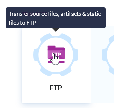
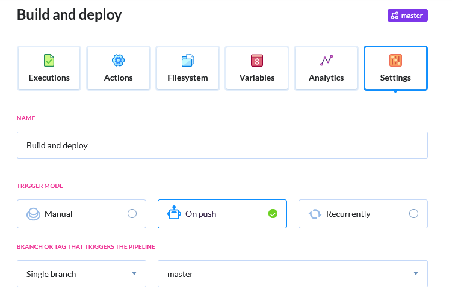
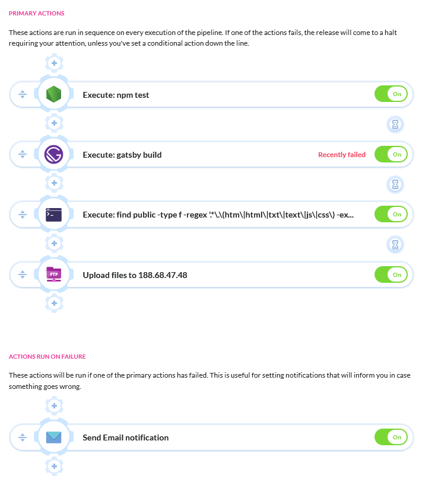

Der Build und Deploy Prozess für eine Gatsby Website kann mit jedem "Push" an ein GitHub Repository mit einer [Buddy](https://buddy.works/ "Buddy") CI /CD pipeline automatisiert werden. 

Hier erfährst du wie du einen Workflow für die kontinuierliche Integration und Bereitstellung ([Continuous Integration and Delivery (CI/CD)](https://de.wikipedia.org/wiki/Kontinuierliche_Integration "Continuous Integration and Delivery (CI/CD)")) mit [Gatsby CLI](https://www.gatsbyjs.org/ "Gatsby CLI"), [Github](https://github.com/ "Github") und [Buddy](https://buddy.works/ "Buddy") kostenlos in ein paar Minuten einrichten kannst.

## Gatsby CLI
Als aller Erstes wird natürlich Gatsby CLI lokal benötigt um das Projekt überhaupt erstellen zu können. Falls noch nicht geschehen kannst du mit
```shell
npm install -g gatsby-cli
gatsby new gatsby-site
```
Gatsby installieren und eine neue Website mit dem einem Default Starter erstellen.
+ Mit ```gatsby develop``` startest du den development server und kannst anschließend unter [localhost:8000](localhost:8000) auf die Seite im Entwicklungsmodus zugreifen. 

+ Mit ```gatsby build``` wird ein produktiver Build erstellt, der alle benötigten HTML-und Javascript Dateien enthält und in "public" im Rootverzeichnis abspeichert. Der "public" Ordner muss nun nurnoch auf einen Webspace hochgeladen werden.

Das wird in nach dem Ende des Beitrags aber automatisiert mit jedem "push" passieren.

## Github

Wenn du noch kein GitHub Repository hast kannst du dir unter [https://github.com/](https://github.com/ "GitHub") kostenlos eines erstellen.
Anschließend gehst du in das Root Verzeichnis der Gatsby Seite und führst folgende Befehle aus:
```shell
touch README.md
git init
git add README.md
git commit -m "first commit"
git remote add origin https://github.com/user/repository-name.git
git push -u origin master
```
Somit hast du deinen ersten "Commit" in dein GitHub Repository hochgeladen.

## CI/CD pipeline via Buddy

Nun benötigst du einen Account bei [Buddy](https://buddy.works/ "Buddy") und erstellst ein neues Projekt.
Hier kannst du mit "Attach a existing GitHub repository" dein GitHub repository verknüpfen.

Unter "Pipelines" kannst du jetzt eine Pipeline erstellen, in der der Befehl `gatsby build` ausgeführt wird und der erstellte "public/" Ordner anschließend via FTP auf dein Webhosting hochgeladen wird.
Dafür fügst du zunächst eine neue "Node.jsAction" hinzu, die alle benötigten Pakete per `npm install` installiert.
Jetzt brauchst du ein Docker image mit Gatsby CLI.


Bevor die Dateien hochgeladen werden ist es sinnvoll, diese in einer kleinen "shell-Aktion" nun zu komprimieren.
```shell
find public -type f -regex .*\.\(htm\|html\|txt\|text\|js\|css\|json\)$ -exec gzip -f -k {} ;
```
Anschließend kannst du mit einer neuen "Action" die Daten per FTP auf ein beliebiges Verzeichnis in deinem Webhosting kopieren.
Hier musst du nur deine FTP Zugangsdaten eingeben.

Falls du Variablen nutzt kannst bzw. musst du diese in der Pipeline auch noch angeben.
Unter "Settings" kannst du einstellen, dass die pipeline mit einem push an das GitHub repository getriggert wird.

Außerdem kann man unter "ACTIONS RUN ON FAILURE" eine Aktion erstellen, die eine Benachrichtigung verschickt.
Falls eine Aktion nicht erfolgreich sein sollte, bekomme ich eine E-Mail, die mich darüber informiert.

Die komplette Pipeline mit allen Aktionen schaut bei mir so aus:


Nun wartet die pipeline auf einen neuen Push und führt dann alle hinzugefügten Aktionen nacheinander aus.
Somit musst man sich nun um nichts mehr kümmern, außer neuen Content zu erstellen oder das Frontend zu überarbeiten.