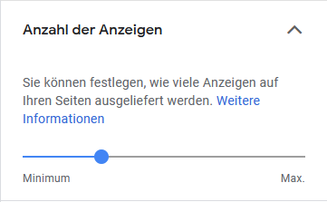

Grundsätzlich gibt es zwei Möglichkeiten Google Adsense auf einer Website zu nutzen und zwar mit 
+ **Auto ads** und
+ einzelnen **Anzeigenblöcken**.

Jenachdem ob man Adsense-Anzeigen an bestimmten Stellen einbinden möchte oder diesen Job die Google KI erledigen lassen will, kann man sich das eine und/oder das andere aussuchen.


## Auto ads

Bei Auto Ads werden über eine Google KI die optimalen Positionen für ein Werbebanner ermittelt und dort eine Displayanzeige automatisch geschalten. Alles was man dafür tun muss ist folgenden AdSense-Code in ```html.js``` zu platzieren.
```html
<script data-ad-client="ca-pub-0037698828864449" async src="https://pagead2.googlesyndication.com/pagead/js/adsbygoogle.js"></script>
```
Auf GIS-Netzwerk.com nutze ich Auto ads und ich bin ehrlich gesagt überrascht wie gut das Ganze funktioniert. 
Anzeigen werden alle paar Paragraphen in einem Text eingeblendet und sind responsiv.

**Anzahl der Anzeigen**
Außerdem hat man in den Einstellungen die Möglichkeit die Anzahl der Anzeigen hoch- bzw. runterzuschrauben.
Leider kann man aber keine konkrete Anzahl festlegen.



**Anzeigenformate**
Auch die Anzeigenformate kann man beeinflussen.
Grundsätzlich gibt es:
+ In-Page-Anzeigen (Anzeige im Hauptteil der Seite)
+ Contentempfehlungen (Tool zur Bewerbung von Inhalten)
+ Ankertexte (mobile Anzeigen am Bildschirmrand)
+ Vignette (mobile Vollbildanzeige, bei Seitenübergängen)

Ich habe nur Ankertexte deaktiviert, da ich diese persönlich sehr nervig finde und auch niemanden Anderem zumuten möchte.


Zusätzlich kann man auch einzelne Seitenkomplett von Anzeigen ausschließen.

Wenn du Auto ads auf deiner GatsbyJS Seite nutzen möchtest, kannst du diese super einfach mit dem plugin [gatsby-plugin-google-adsense](https://www.gatsbyjs.org/packages/gatsby-plugin-google-adsense/ "gatsby-plugin-google-adsense") implementieren.

**Installieren**
```bash
npm install --save gatsby-plugin-google-adsense
```
bzw.
```bash
yarn add gatsby-plugin-google-adsense
```
**gatsby-config.js anpassen**
```js
// In your gatsby-config.js file
plugins: [
    {
      resolve: `gatsby-plugin-google-adsense`,
      options: {
        publisherId: `ca-pub-xxxxxxxxxx`
      },
    },
]
```
Die restlichen Einstellungen können dann auf [Adsense](https://www.google.com/adsense/ "Adsense") angepasst werden.

## Anzeigenblöcke
Neben Auto ads gibt es noch die "klassische" Möglichkeit einzelne Anzeigenblöcke an bestimmten Positionen einzufügen.
Mit dem React Component [react-adsense](https://github.com/hustcc/react-adsense "react-adsense") kann man Google AdSense und auch Baidu Anzeigen an belieben Stellen einfügen.
```bash
npm install --save react-adsense
```
bzw.
```bash
yarn add react-adsense
```

Damit die Components auch gerendert werden benötigt man noch den AdSense script Code. Diesen kann man entweder manuell in der Datei ```html.js```einfügen oder wenn man einzelne Anzeigenblöcke mit Auto ads kombinieren möchte, kann auch das bereits genannte Plugin genutzt werden, um das Script einzufügen.

_Wenn Auto ads und einzelne Anzeigenblöcke kombiniert werden, haben die einzelnen Anzeigenblöcke immer eine höhere "Priorität". Das heißt alle Anzeigenblöcke, die manuell eingefügt werden normalerweise auch gerendert und sofern das Text/Ads Verhältnis es zulässt werden noch weitere Anzeigen von Auto ads automatisch eingefügt._

Wenn das script eingebunden und react-adsense installiert wurde kann man mit
```js
import React from 'react';
import AdSense from 'react-adsense';

// ads with no set-up
<AdSense.Google
  client='ca-pub-7292810486004926'
  slot='7806394673'
/>

// ads with custom format
<AdSense.Google
  client='ca-pub-7292810486004926'
  slot='7806394673'
  style={{ width: 500, height: 300, float: 'left' }}
  format=''
/>

// responsive and native ads
<AdSense.Google
  client='ca-pub-7292810486004926'
  slot='7806394673'
  style={{ display: 'block' }}
  layout='in-article'
  format='fluid'
/>

// auto full width responsive ads
<AdSense.Google
  client='ca-pub-7292810486004926'
  slot='7806394673'
  style={{ display: 'block' }}
  format='auto'
  responsive='true'
  layoutKey='-gw-1+2a-9x+5c'
/>
```
Components für die Anzeigenblöcke einfügen.

Das Ad-Component rechts unter dem Inhaltsverzeichnis schaut beispielsweise so aus:
```js
<AdSense.Google client='ca-pub-0037698828864449' slot='6317800418' style={{width:'300',height:'250'}}/>
```


Die jeweilige client id 
```js
client='ca-pub-7292810486004926'
``` 
und der Ad Slot 
```js
slot='7806394673'
```
**müssen immer** angegeben werden.

Der Rest ist optional.
```
Optional props:
    className:
    style:
    layout:
    layoutKey:
    format:
    responsive:
```

[react-adsense](https://github.com/hustcc/react-adsense "react-adsense")