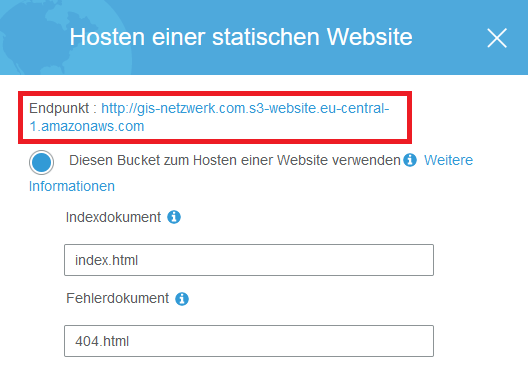

Mit [AWS](https://aws.amazon.com/de/?nc2=h_lg "AWS") (und insbesondere dem [kostenlosen AWS-Kontigent](https://aws.amazon.com/de/free/?nc2=h_ql_pr_ft&all-free-tier.sort-by=item.additionalFields.SortRank&all-free-tier.sort-order=asc "kostenloses AWS-Kontigent")) hat man die Möglichkeit eine statische Webseite mit einer Custom Domain für ein paar Cent im Monat inklusive CDN via CloudFront und CI/CD Integration zu hosten. 

**Warum sollte ich auf AWS umsteigen?**

Bevor ich komplett auf AWS umgestiegen bin, hatte ich einen üblichen Shared-Hosting Tarif der mich im Jahr ca. 72€ gekostet hat. Bei diesem Tarif hatte ich
+ 250 GB SSD Speicherplatz,
+ kostenlos unbegrenzten Traffic,
+ 6 Domains inklusive,
+ 250 GB SSD Mail Speicherplatz,
+ 25 MySQL Datenbanken,
+ und, und, und.

Im Großen und Ganzen also wesentlich mehr als ich für den Betrieb meiner statischen [GatsbyJS](https://www.gatsbyjs.org/)-Webseite benötige.

Also warum sollte ich nicht nur Ressourcen nutzen und bezahlen, die ich letztendlich auch brauche und nebenbei auch noch etwas Cloud-Erfahrung sammeln?

Gedacht, getan.

## S3 Buckets erstellen

Die Grundlage für das Hosting auf AWS bilden [S3 Buckets](https://s3.console.aws.amazon.com/s3/home "S3 Buckets"). Buckets sind "Container" im Web auf denen man Dateien speichern kann.
Damit Redirects von Subdomains wie zum Beispiel **www.gis-netzwerk.com** auf **gis-netzwerk.com** funktionieren brauch man für jede Domain ein Bucket.

Als aller Erstes erstellt man also ein S3-Bucket für die Root-Domain ein Bucket. Als Bucket Namen gibt man den Domain-Namen also in meinem Fall gis-netzwerk.com an und wählt eine Region (EU (Frankfurt)) aus.
Unter Optionen können die Standardeinstellungen behalten werden, sofern man nicht verschiedene Versionierungen oder Zugriffsrotokolle speichern möchte.
Damit jeder auf den Website Inhalt später zugreifen kann muss das Häcken, das standardmäßig bei "Blockieren *jeglichen* öffentlichen Zugriffs" vorhanden ist, entfernen, prüft die Bucket Einstellungen noch einmal und erstellt es.

In jedem Bucket kann bzw. sollte man eine Bucket-Richtlinie eingeben, die den Zugriff noch weiter definiert.
Dafür klickt man auf den Namen des Buckets und geht auf "Berechtigungen" -> "Bucket-Richtline".

Für den öffentlichen Zugriff muss hier dann folgende Richtlinie abgespeichert werden.
```json
{
    "Version": "2008-10-17",
    "Statement": [
        {
            "Sid": "AllowPublicRead",
            "Effect": "Allow",
            "Principal": {
                "AWS": "*"
            },
            "Action": "s3:GetObject",
            "Resource": "arn:aws:s3:::gis-netzwerk.com/*"
        }
    ]
}
```
**"gis-netzwerk.com" mit deinem Bucket-Namen ersetzen!**

Wenn alles richtig gemacht wurde sollte es in den Berechtigungen nun etwa so aussehen:


Bei den Bucket Einstellungen muss man das "Hosten einer statischen Webseite" aktivieren und ein Indexdokument, sowie ein Fehlerdokument angeben.
Für GatsbyJS wäre das **index.html** und **404.html**.


Nun fehlt noch das S3-Bucket für die Sub-Domain **www.gis-netzwerk.com**.
Also neues Bucket mit dem Namen der Sub-Domain **www.gis-netzwerk.com** mit öffentlichen Zugriff erstellen und die Bucket-Richtlinie hinzufügen.
In den Einstellungen bei "Hosten einer statischen Webseite" verwendet man hier dann allerdings "Anfragen umleiten" und gibt das Ziel-Bucket **gis-netzwerk.com** und als Protokoll kann man schon einmal **https** angeben, da später via CloudFront die Daten übermittelt werden, das mit SSL-Zertifikaten verschlüsselt werden kann.


Die Buckets sind somit erstellt und für den Betrieb einer statischen Website inkl. Redirect richtig konfiguriert.


## CloudFront Distributions

Mit dem kostenlosen Kontigent von AWS können monatlich 50 GB Datentransfer in Cloudflare verbraten werden.
Bei einer Seitengröße von großzügigen 4 MB reicht das für monatlich für 12.500 Seitenaufrufe und sollte für eine Webseite mit durchschnittlichem Traffic also mehr als ausreichend sein. Warum also ein kostenloses CDN nicht mitnehmen?
Falls die nach dem kostenlosen Jahr anfallenden Kosten jemanden abschrecken sollten, hat man immer noch die Möglichkeit auf einen anderen CDN-Anbieter wie zum Beisp [CloudFlare](https://www.cloudflare.com "CloudFlare") zu wechseln.

Unter [CloudFront](https://console.aws.amazon.com/cloudfront/ "CloudFront") muss man nur für jedes Bucket eine Web-Distribution erstellen.
Als Origin Domain Name darf hier **nicht** ein Bucket aus der Dropdownliste ausgewählt werden, sondern der Endpunkt der Buckets aus S3 kopiert werden.



In der Distribution für das Bucket **gis-netzwerk.com** wird also zum Beispiel "gis-netzwerk.com.s3-website.eu-central-1.amazonaws.com" als Origin angegeben.
"Origin ID" wird daraufhin automatisch ausgefüllt. Bei "Viewer Protocol Policy" wird **Redirect HTTP to HTTPS** ausgewählt, da User nur über HTTPS auf die Webseite zugreifen können sollen. Bei "Compress Objects Automatically" kann noch **Yes** ausgewählt werden.
Unter "Alternate Domain Names (CNAMES)" musst du bei der Distribution für die Root-Domain das Bucket für die Root-Domain angeben. Also zum Beispiel gis-netzwerk.com

Bei "SSL-Certifacte" kannst bzw. musst du nun für die beiden Domains **gis-netzwerk.com** und **www.gis-netzwerk.com** ein kostenloses Amazon SSL-Zertifikat via dem [Certificate Manager (ACM)](https://aws.amazon.com/de/certificate-manager/ "Certificate Manager (ACM)") erstellen. Dafür fügst du deine beiden Domains in ACM hinzu. 


Diese kannst du nun über eine DNS- oder E-Mail Methode validieren lassen. Falls du deine Domain bei Route 53 eingebunden hast kannst du das mehr oder weniger automatisiert machen, indem du einfach den Anweisungen folgst.

Zurück in der CloudFront Distribution Erstellen musst du nun nurnoch ein "Default Root Object" angeben. -> index.html
Wenn du das nicht machst zeigt CloudFront immer eine "Access Denied"-Message im XML-Format wenn du auf deine Domain zugreifst.

Als letztes muss die Distribution natürlich noch bei "Distribution State" aktiviert werden.

Erste Distribution fertig. Das Gleiche Prozedere nun für die Sub-Domain **www.gis-netzwerk.com** mit dem dazugehörigen "Origin Domain Name"(**Bucket Endpunkt!**)

_Das kann bis zu 20 Minuten dauern_
(Wenn du deinen CloudFront Cache clearen willst und AWS CLI bereits installiert hast kannst du das mit folgendem Command machen:
```shell
aws cloudfront create-invalidation --distribution-id DEINE_DISTRIBUTION ID --paths "/*"
```
Dazu aber im zweiten Teil noch mehr.)
Währendessen kannst du schon einmal die Redirects für Cloudfront in Route 53 erstellen.

## Route 53 DNS Einstellungen

In [Route 53]( "Route 53") benötigst du eine gehostete Zone (= 0,50€ im Monat). Anschließend müssen A (und sofern in der CLoudFrontDistribution IPv6
aktiviert ist (was es standardmäßig ist), ebenso ein AAAA) Datensatz erstellt werden.
D.h du benötigst im Prinzip 4 "Alias"-Datensätze:
+ gis-netzwerk.com A "CloudFront-URL für Root-Domain"
+ gis-netzwerk.com AAAA "CloudFront-URL für Root-Domain"
+ www.gis-netzwerk.com A "CloudFront-URL für Sub-Domain"
+ www.gis-netzwerk.com AAAA "CloudFront-URL für Sub-Domain"

Die CDN-Url kannst du hier ausnahmsweise aus der Dropdownliste auswählen.
Bei "Routing-Richtlinie" und "Zustand des Ziels bewerten" kannst du die default-Einstellungen belassen,sofern du nicht experimentieren möchtest.

Wenn du nun etwas wartest solltest du wenn du
+ http://wwww.gis-netzwerk.com,
+ https://wwww.gis-netzwerk.com,
+ wwww.gis-netzwerk.com,
+ http://gis-netzwerk.com oder
+ gis-netzwerk.com
eingibst immer unter **https://gis-netzwerk.com** landen.


