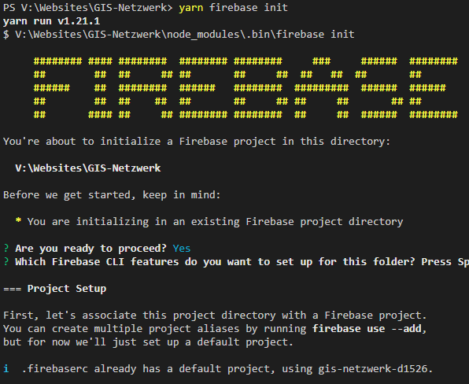
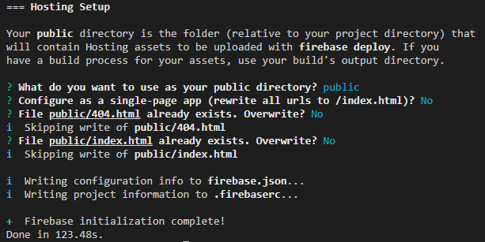

With Google Cloud (Build) you can automate your whole workflow from building your Gatsby site up to deploying your site to Firebase hosting.

**What will you need?**

+ [Firebase Hosting](https://firebase.google.com/products/hosting "Firebase Hosting")
+ [Cloud Build](https://cloud.google.com/cloud-build "Cloud Build")
+ [Cloud Scheduler](https://cloud.google.com/scheduler "Cloud Scheduler") (optional)

## Firebase Hosting

To set up Firebase you will need an Google Cloud Account which has billing enabled and at least one project.
You can add the Firebase SDK with:

```
npm install --save firebase
```

and configure it with

```
firebase init
```

In the process you can setup a new project which will create a new ```.firebaserc``` file if it doesn't exist yet and enable **Hosting**.



As public directory you have to set your **public** folder. After you have set your public folder you can reject all oncoming messages.



> You can also have a look at the Offical [Google Firebase Docs](https://firebase.google.com/docs/cli#install-cli-windows "Google Firebase Docs") for setting up Firebase.

In the end it will also create a **firebase.json** where you can copy/paste the following to optimize your hosting for a Gatsby site.

```json
{
  "hosting": {
    "public": "public",
    "ignore": [
      "firebase.json", 
      "**/.*", 
      "**/node_modules/**"],
    "headers": [
      {
        "source": "**/*",
        "headers": [
          {
            "key": "cache-control",
            "value": "cache-control: public, max-age=0, must-revalidate"
          }
        ]
      },
      {
        "source": "static/**",
        "headers": [
          {
            "key": "cache-control",
            "value": "public, max-age=31536000, immutable"
          }
        ]
      },
      {
        "source": "**/*.@(css|js)",
        "headers": [
          {
            "key": "cache-control",
            "value": "public, max-age=31536000, immutable"
          }
        ]
      },
      {
        "source": "sw.js",
        "headers": [
          {
            "key": "cache-control",
            "value": "cache-control: public, max-age=0, must-revalidate"
          }
        ]
      },
      {
        "source": "page-data/**",
        "headers": [
          {
            "key": "cache-control",
            "value": "cache-control: public, max-age=0, must-revalidate"
          }
        ]
      }
    ],
  }
}
```
When you have build your Gatsy site and **public** folder is present you can upload it to your Firebase Hosting with:

```
firebase deploy
```

If you want to use your custom domain (for example gis-netzwerk.com) you have to go to Hosting in the Firebase console where you will find DNS-records to point your domain to your Firebase Hosting.
You can also create a second domain (for example www.gis-netzwerk.com) to redirect automatically to your root domain.

In your project settings you can find your Firebase configurations which look like:

```
const firebaseConfig = {
  apiKey: "apiKey",
  authDomain: "{.firebaseapp.com",
  databaseURL: "https:// projectId.firebaseio.com",
  projectId: " projectId",
  storageBucket: " projectId.appspot.com",
  messagingSenderId: "1",
  appId: "2",
  measurementId: "G-123"
};
```

You probably want to save these as environment variables.

## Cloud Build

To create a CI-/CD-Pipeline you have to activate Cloud Build for your account. The console itself is quite clear in comparison to AWS CodeBuild.
You will see Dashboard which is displaying some basic informations, the history of your Cloud Builds, Triggers and Options.

You just will have to create a new trigger which will trigger a new build everytime new content is pushed to your linked GitHub repository..

First of all you have to connect your repository. After that you can create the trigger.


Important options are:
+ Event: **Push to branch**
+ Branch: **^master$** (or whatever branch you want to build)
+ Cloud Build Configuration file: **cloudbuild.yaml**

After that you can create all environment variables as **Substitution variables**.
You will notice that all variables have to start with an underscore.
Because of that we will need a small workaround in the cloudbuild.yaml configuration file.

For now you can just create your substitions variables and add the underscore to your default variable names.

To be able to deploy via firebase you will need to authorize Firebase with a '$_TOKEN'.
You can retrive this token on your local machine with_
```
firebase login:ci
```

A new page will be opened in your prefered browser where you will have to login with your Google account to get the token.
Once you have the token you can also add it as substition variable.
```
_TOKEN : {TOKEN VALUE}
```

If you have created all substitution variables you can check again if they are inserted correct and create the new trigger.

### Cloudbuild.yaml

Cloud build needs the cloudbuild.yaml to know what it should do.
If you have inserted the path like above mentioned you will need a cloudbuild.yaml in your root directory.

You can copy the following into it:
```yaml
steps: 
# Install dependencies
  - name: node:10.16.0
    id: Installing dependencies...
    entrypoint: npm
    args: ["install"] 
    waitFor: ["-"] # Begin immediately

# Install Firebase   
  - name: node:10.16.0 
    id: Installing Firebase...
    entrypoint: npm 
    args: ["install", "firebase-tools"]
    waitFor:
      - Install dependencies...

# Create file with env-variables
  - name: node:10.16.0
    id: Creating Envirnonment variables...
    entrypoint: npm
    args: ["run", "create-env"]
    env:
    - "CLIENT_EMAIL=${_CLIENT_EMAIL}"
    - "PRIVATE_KEY=${_PRIVATE_KEY}"
    - "MAIL_CHIMP=${_MAIL_CHIMP}"
    - "GA_ID=${_GA_ID}"
    - "GA_VIEW_ID=${_GA_VIEW_ID}"
    - "IG_TOKEN=${_IG_TOKEN}"
    - "FIREBASE_API_KEY=${_FIREBASE_API_KEY}"
    - "FIREBASE_APP_ID=${_FIREBASE_APP_ID}"
    - "FIREBASE_AUTH_DOMAIN=${_FIREBASE_AUTH_DOMAIN}"
    - "FIREBASE_DB_URL=${_FIREBASE_DB_URL}"
    - "FIREBASE_MEASUREMENT_ID=${_FIREBASE_MEASUREMENT_ID}"
    - "FIREBASE_MESSAGE_SENDER_ID=${_FIREBASE_MESSAGE_SENDER_ID}"
    - "FIREBASE_PROJECT_ID=${_FIREBASE_PROJECT_ID}"
    - "FIREBASE_STORAGE_BUCKET=${_FIREBASE_STORAGE_BUCKET}"
    - "GATSBY_EXPERIMENTAL_PAGE_BUILD_ON_DATA_CHANGES=true"
    waitFor: ["-"] # Begin immediately

# Gatsby build
  - name: node:10.16.0
    id: Building Gatsby site...
    entrypoint: npm
    args: ["run", "build"]
    waitFor:
      - Installing dependencies...
      - Creating Envirnonment variables...

# Deploy
  - name: node:10.16.0 
    id: Deploying to Firebase...
    entrypoint: "./node_modules/.bin/firebase" 
    args: ["deploy", "--project", "$PROJECT_ID", "--token", "$_TOKEN"]
    waitFor:
      - Installing Firebase...
      - Building Gatsby site...
    
timeout: 30m0s
```
The cloudbuild.yaml is basically divided into six parts which will
+ Install dependencies,
+ Install Firebase,
+ Create file with env-variables,
+ Build the Gatsby site and
+ Deploy it to Firebase

As you can see you will create a file with the environment variables which will map the substitutions variables with your "default" variables.
Everything else should be pretty self-explanatory.

> Cloud Build will timeout the build by default after 10 minutes. So if your build is gonna take longer you will have to set up a custom timeout like in the cloudbuild.yaml above. You can also set a timeout for each step.

Another import point is that you will have to add the Plugin for Google Analytics Reporting Api as dynamic plugin like for example the following because otherwise you will get errors during your build.
```
if (
  process.env.CLIENT_EMAIL &&
  process.env.PRIVATE_KEY &&
  process.env.GA_VIEW_ID
) {
  const startDate = new Date()
  startDate.setMonth(startDate.getMonth() - 3)
  dynamicPlugins.push(
    /*{
      resolve: `gatsby-plugin-guess-js`,
      options: {
        GAViewID: process.env.GA_VIEW_ID,
        jwt: {
          client_email: process.env.CLIENT_EMAIL,
          private_key: process.env.PRIVATE_KEY.replace(/\\n/g, "\n"),
        },
        period: {
          startDate,
          endDate: new Date(),
        },
      }
    },*/
    {
      resolve: `gatsby-source-google-analytics-reporting-api`,
      options: {
        email: process.env.CLIENT_EMAIL,
        key: process.env.PRIVATE_KEY.replace(/\\n/g, "\n"),
        viewId: process.env.GA_VIEW_ID,
        startDate: `2009-01-01`,
      }
    }
  )
}

module.exports = {
  plugins: [
    plugins...
  ].concat(dynamicPlugins),
};

Due to the fact that Code Build uses Linux machines small and capital letters are important (Windows doesnt care).
That means if you import a component like
```js
import MyComponent from "../Mycomponent"
```
and the actual folder name is ```MyComponent``` your build will fail.

### Speeding up your builds

+ **Image optimization**

If you aren't using preoptimized images yet you should consider to crop, resize images etc. **before** you will build the site because it can basically save a lot of time (depending on the amount of images).

Before i optimized my images a build on Google Cloud took about ~ 1800 sec.
After i optimized all my images for posts with Python ([Image optimization with Python](/en/web-development/image-optimization-transformation-python/ "Image optimization with Python")) the build time went down to ~ 620 sec. So actually just a third.

### Set Cloud Scheduler (optional)

With Cloud Scheduler you can trigger a build automatically after a specific time.
The first 3 jobs a month a free and after that you have to pay $0.10 for every job after that.

(You can also use Cloud Scheduler with your default trigger (Push to branch) or without).

The trigger you created before has an ID and with a POST request you can start the trigger anytime you want.
To get the ID of the trigger you have to open the Cloud Shell, type ```gcloud beta builds triggers list``` and search for **id**. Copy that.

The URL for the POST request looks like (without []):
```
https://cloudbuild.googleapis.com/v1/projects/[PROJECT_ID]/triggers/[TRIGGER_ID]:run
```
Now you have to create a new job in Cloud Schedule.


```
0 3 * * *
```
will trigger a build every day at 3 am MESZ. 

The URL for the POST request looks like (without []):
```
https://cloudbuild.googleapis.com/v1/projects/[PROJECT_ID]/triggers/[TRIGGER_ID]:run
```

In Text you will need
```json
{
  "branchName": "master"
}
```
and you will authorize the job with your service account.
