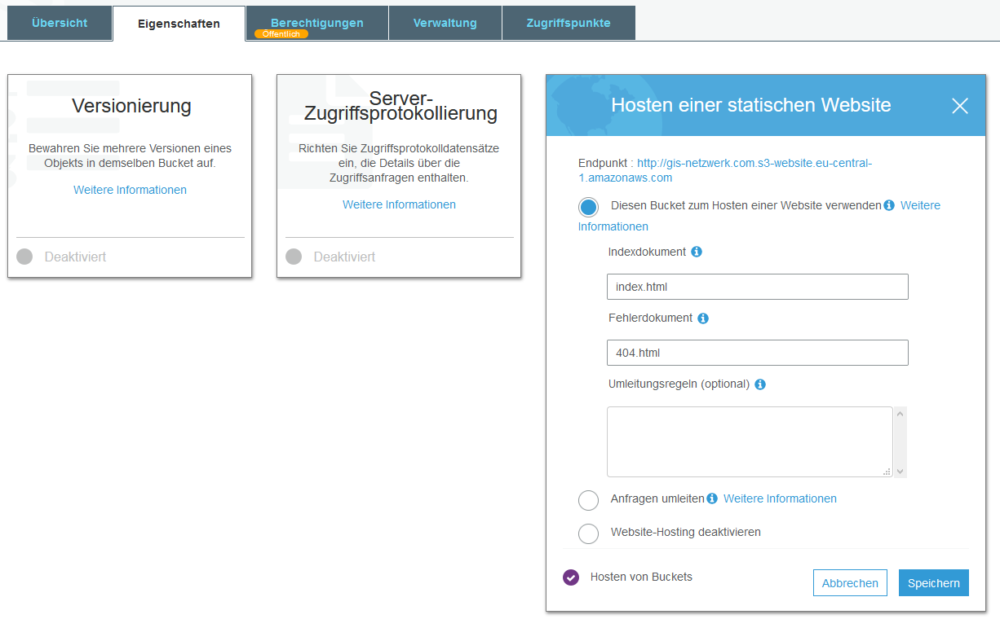

With [AWS](https://aws.amazon.com/ "AWS") (and in particular the [free AWS contingent](https://aws.amazon.com/en/free/ "free AWS account")) you have the option of a static website with a custom domain for a few Hosting cents a month including CDN via CloudFront and CI / CD integration.

** Why should I switch to AWS? **

Before I switched completely to AWS, I had a common shared hosting tariff that cost me around € 72 a year. With this tariff I had
+ 250 GB SSD storage space,
+ free unlimited traffic,
+ 6 domains included,
+ 250 GB SSD mail storage space,
+ 25 MySQL databases,
+ and, and, and.

On the whole, much more than I need to run my static [GatsbyJS](https://www.gatsbyjs.org/) website.

So why shouldn't I only use and pay for resources that I ultimately need and also get some cloud computing experience?

Thought, done.

## Creating S3-Buckets 

The basis for hosting on AWS is formed by [S3 Buckets](https://s3.console.aws.amazon.com/s3/home "S3 Buckets"). 
Buckets are "containers" on the web where you can save files.
In order for redirects from subdomains such as **www.gis-netzwerk.com** to **gis-netzwerk.com** to work, you need a bucket for each domain.

First of all, you create an S3 bucket for the root domain. In my case, the bucket name is the domain name gis-netzwerk.com and you select a region (for example EU (Frankfurt)).
The default settings can be kept under Options, unless you want to save different versions or access protocols.
So that everyone can access the website content later, remove the tick that is present by default at "Block *any* public access", check the bucket settings again and finally create it.

In each bucket you can or should enter a bucket policy that further defines access.
To do this, click on the name of the bucket and go to "Permissions" -> "Bucket Policy".

The following guideline must then be saved for public access.
```json
{
    "Version": "2008-10-17",
    "Statement": [
        {
            "Sid": "AllowPublicRead",
            "Effect": "Allow",
            "Principal": {
                "AWS": "*"
            },
            "Action": "s3:GetObject",
            "Resource": "arn:aws:s3:::gis-netzwerk.com/*"
        }
    ]
}
```
**"gis-netzwerk.com" has to be replace with your bucket name!**

If everything was done correctly, the permissions should now look something like this:


In the bucket settings you have to activate the "hosting a static website" and specify an index document and an error document.
For GatsbyJS that would be **index.html** and **404.html**.



Now the S3 bucket for the subdomain **www.gis-netzwerk.com** is still missing.
So create a new bucket with the name of the subdomain **www.gis-netzwerk.com** with public access and add the bucket policy.

In the settings for "hosting a static website" you use "redirect requests" and enter the target bucket **gis-netzwerk.com** and you can enter **https** as a protocol, because later on the content of the static website is delivered via CloudFront, which can be encrypted with SSL certificates.


The buckets are now created and correctly configured for the operation of a static website including redirect.


## CloudFront Distributions

With the free AWS contingent, 50 GB of data transfer can be burned per month in Cloudflare.

With a page size of generous 4 MB, this is enough for 12,500 page views per month and should therefore be more than sufficient for a website with average traffic. So why not take a free CDN with you?

If the costs incurred after the free year should deter someone, you still have the option to switch to another CDN provider such as [CloudFlare](https://www.cloudflare.com "CloudFlare").

At [CloudFront](https://console.aws.amazon.com/cloudfront/ "CloudFront") you have to create a web distribution for **each** bucket.
As the origin domain name, a bucket can **not** be selected from the dropdown list, but the end point of the bucket from S3 must be copied.


In the distribution for the bucket **gis-netzwerk.com**, for example "gis-netzwerk.com.s3-website.eu-central-1.amazonaws.com" is specified as origin.
"Origin ID" will then be filled in automatically. In "Viewer Protocol Policy" **Redirect HTTP to HTTPS** is selected because users should only be able to access the website via HTTPS.  "Compress Objects Automatically" **Yes** can be selected, so that CloudFront will zip all files automatically.
Under "Alternate Domain Names (CNAMES)" you have to specify the bucket for the root domain for the distribution for the root domain. For example gis-netzwerk.com

At "SSL-Certifacte" you can now create for the two domains **gis-netzwerk.com** and **www.gis-netzwerk.com** two free Amazon SSL certificate via the [Certificate Manager (ACM )](https://aws.amazon.com/en/certificate-manager/ "Certificate Manager (ACM)"). To do this, add your two domains in ACM.


You can now have this validated using a DNS or email method. If you have included your domain in Route 53, you can do it more or less automatically by simply following the instructions.

Back in the CloudFront Distribution Creation you only have to specify a "Default Root Object". -> index.html
If you don't do this, CloudFront always shows an "Access Denied" message in XML format when you access your domain (atleast that was my case).

Finally, the distribution must of course still be activated under "Distribution State".

First distribution finished. The same procedure now for the subdomain **www.gis-netzwerk.com** with the corresponding "Origin Domain Name" (**Bucket end point!**)

_This can take up to 20 minutes_
(If you want to clear your CloudFront cache and have already installed AWS CLI, you can do this with the following command:

```shell
aws cloudfront create-invalidation --distribution-id DEINE_DISTRIBUTION ID --paths "/*"
```

Dazu aber im zweiten Teil noch mehr.)
In the meantime, you can create the redirects for Cloudfront in Route 53.

## Route 53 DNS settings

In [Route 53]("Route 53") you need a hosted zone (= 0.50€ per month). Then A (and provided that in the CLoudFrontDistribution IPv6 is
activated (which it is by default), as well as an AAAA) data record can be created.

That means you basically need 4 "alias" data sets:
+ gis-netzwerk.com A "CloudFront URL for root domain"
+ gis-netzwerk.com AAAA "CloudFront URL for root domain"
+ www.gis-netzwerk.com A "CloudFront URL for subdomain"
+ www.gis-netzwerk.com AAAA "CloudFront URL for subdomain"

Exceptionally, you can select the CDN url from the dropdown list.
With "Routing Guideline" and "Assess the state of the target" you can leave the default settings, unless you want to experiment.

Now if you wait a little you should be redirect from
+ http://wwww.gis-netzwerk.com,
+ https://wwww.gis-netzwerk.com,
+ wwww.gis-netzwerk.com,
+ http://gis-netzwerk.com and
+ gis-netzwerk.com
to **https://gis-netzwerk.com** .
